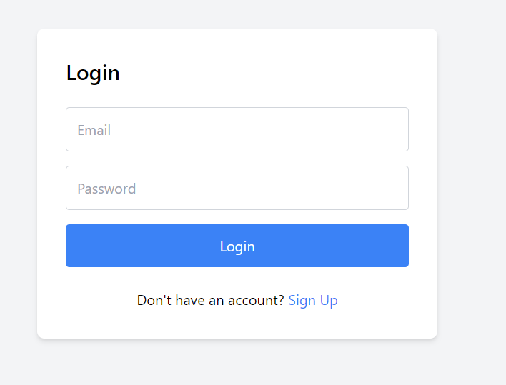
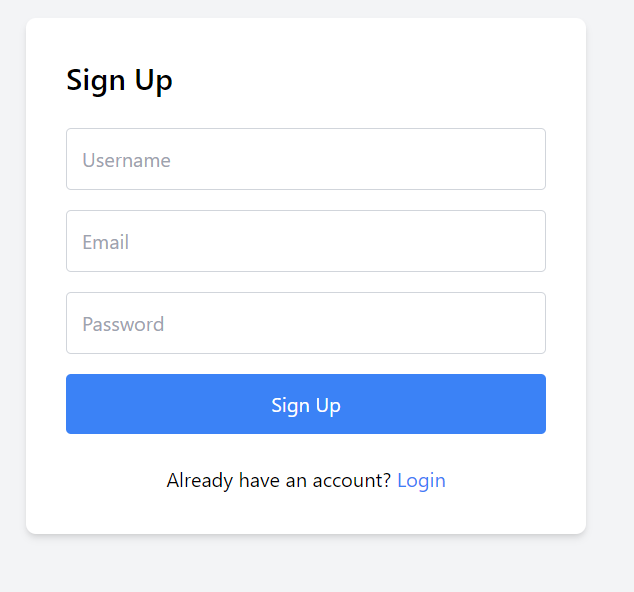
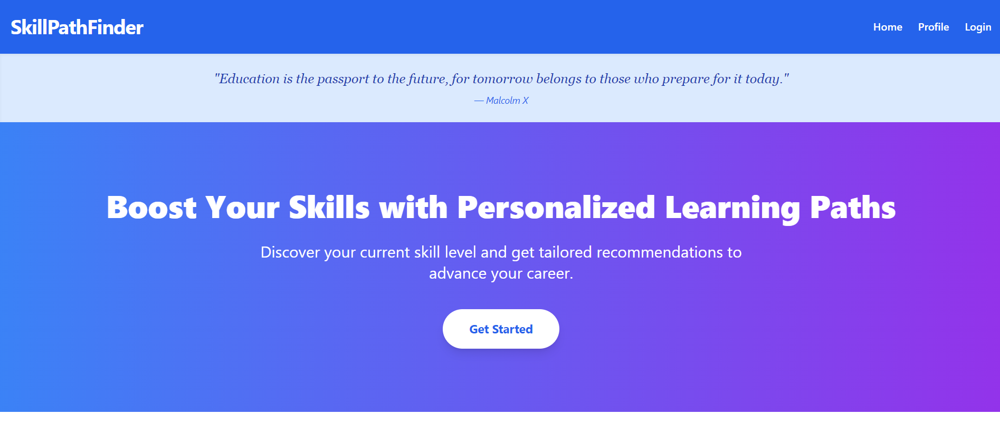
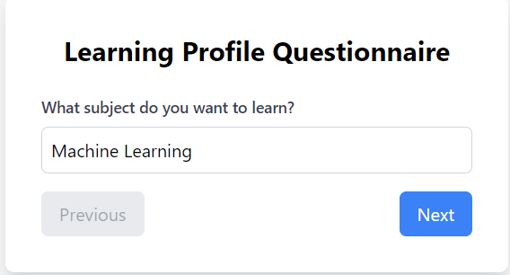

# SkillPathFinder

SkillPathFinder is a comprehensive platform designed to help individuals identify and develop the skills necessary for their career paths. Whether you're looking to enhance your existing skills or learn something new, SkillPathFinder provides personalized recommendations and resources tailored to your goals.

## Table of Contents
1. [Project Overview](#project-overview)
2. [Technologies Used](#technologies-used)
3. [Installation and Usage](#installation-and-usage)
4. [Features](#features)
5. [Screenshots](#screenshots)
6. [Contributors](#contributors)
7. [License](#license)

## Project Overview

SkillPathFinder helps users identify their career goals and the skills needed to achieve them. It offers curated resources, a skill assessment feature, and progress tracking to ensure users are on the right path to their desired careers. The platform leverages the MERN stack and integrates with the Gemini API to provide accurate and personalized recommendations.

## Technologies Used

- **Frontend:** React, Redux, Tailwind CSS
- **Backend:** Node.js, Express
- **Database:** MongoDB
- **API Integration:** Gemini API
- **Authentication:** JWT
- **Deployment:** Render

## Screenshots

- **Login Page**
  

- **Sign Up Page**
  

- **Home Page**
  

- **Questionnaire Page**
  

- **User Dashboard**
  

- **Recommendations Page**
  

## Features

- **Skill Assessment:** 
  - Evaluate your skills through comprehensive assessments.
  - Receive detailed feedback on your strengths and areas for improvement.

- **Personalized Recommendations:**
  - Get curated suggestions for courses, tutorials, and resources based on your career goals.
  - The Gemini API integration ensures that recommendations are up-to-date and relevant.

- **Progress Tracking:**
  - Monitor your progress over time with detailed analytics.
  - Set goals and track your achievements as you develop new skills.

- **User-Friendly Interface:**
  - Enjoy a clean, intuitive design that makes navigation easy.
  - Access all features seamlessly, whether on desktop or mobile.

- **Secure and Reliable:**
  - Benefit from robust security features, including JWT-based authentication.
  - Data integrity and user privacy are prioritized throughout the platform.

## Installation and Usage

To get started with SkillPathFinder, follow these steps:

1. **Clone the repository:**
   \`\`\`bash
   git clone (https://github.com/therishabhmittal-05/SkillPathFinder/).git
   \`\`\`
2. **Navigate to the project directory:**
   \`\`\`bash
   cd SkillPathFinder
   \`\`\`
3. **Install the dependencies for both frontend and backend:**
   \`\`\`bash
   npm install
   \`\`\`
4. **Start the backend server:**
   \`\`\`bash
   cd server
   npm start
   \`\`\`
5. **Start the frontend development server:**
   \`\`\`bash
   cd ../client
   npm start
   \`\`\`
6. **Open your browser and visit:**
   \`\`\`
   http://localhost:3000
   \`\`\`

## Contributors

- [Mehak Singla](https://github.com/mehaksingla2005)
- [Rishabh Mittal](https://github.com/therishabhmittal-05)
- [Pinak Gupta](https://github.com/PinakGupta)

## License

This project is licensed under the MIT License - see the [LICENSE](LICENSE) file for details.
